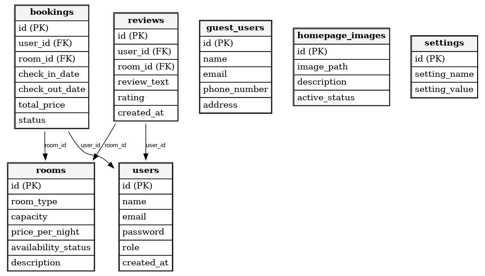

# UIA_Motell_Prosjekt with PHP

# Github link : https://github.com/Bunyamin54/uia_motell

# Access Information

Admin Credentials:
To access the admin panel, use the following credentials:

Email: admin@example.com
Password: admin123

Guest Access:
Guests can register and log in to view and manage their bookings on their personalized dashboard.


# Database credentials

//   Database host      '127.0.0.1' 
//   Database name      'uia_motell'  
//   Database username  'root';       
//   Database password  '123';        
//   'APP_NAME',        'UIA Motel';   
//   'BASE_URL',        'http://localhost/uia_motell/';


# Room Booking System

This project is a dynamic web application for managing room bookings in a small motel with a total of 25 rooms.

Project Description

RoomBookingSystem is a web-based application that enables users to book rooms of various types in a motel. Built with PHP and Bootstrap, this system aims to efficiently handle room reservations for both guests and administrators.

Features

Room Types and Capacity

Offers at least three room types: Single Room, Junior Suite, and Family Suite.
Each room type has predefined capacity limits for the number of adults and children.

Room Management (Administrator Only)

Administrators can:

Add, update, or delete room types.
Set rooms as unavailable for specific periods (e.g., maintenance or special events).
Manage room availability through a dedicated administrative interface.

Room Booking for Guests

Guests can:
Search for available rooms by specifying check-in and check-out dates.
Provide details such as the number of adults and children.
Specify optional preferences like floor level or proximity to elevators.

Loyalty Program and Guest Profile

Guests can:

View booking history and retrieve receipts.
Update personal details and save preferences for future bookings.

Technologies Used

Backend: PHP 8.2
Frontend: HTML5, CSS3 (Bootstrap), JavaScript (jQuery), and Toastify for notifications.
Database: MySQL (managed via phpMyAdmin), used for storing user and booking data.

Installation Requirements

Server
A web server such as Apache, with phpMyAdmin for database management.

PHP version 8.0 or higher.

Database
MySQL or MariaDB to handle data storage.


# Room Booking System

```

UIA_MOTELL/
├── admin/
│   ├── ajax_rooms.php            
│   ├── available_rooms.php       
│   ├── booking.php            
│   ├── confirmation.php          
│   ├── dashboard.php            
│   ├── home.php                 
│   ├── login.php                
│   ├── logout.php               
│   ├── payment.php              
│   ├── rooms.php                
│   ├── settings.php             
│   ├── update_shutdown.php      
├── config/
│   ├── config.php                
│   ├── db.php                   
├── inc/
│   ├── contact.php               
│   ├── footer.php               
│   ├── home.php                 
│   ├── login_register.php      
│   ├── navbar.php                
│   ├── reviews.php               
│   ├── rooms.php               
├── migrations/
│   ├── run-mig.php              
│   ├── run-seed.php            
├── public/
│   ├── images/                  
│   │   ├── home/                 
│   │   ├── reviews/              
│   │   ├── rooms/               
│   ├── index.php                 
│   ├── scripts.js                
│   ├── styles.css                
├── README.md                   


## Database Schema

The following diagram illustrates the structure of the `uia_motell` database:



### Tables Overview

1. **bookings**:
   - `id` (Primary Key)
   - `user_id` (Foreign Key)
   - `room_id` (Foreign Key)
   - `check_in_date`
   - `check_out_date`
   - `total_price`
   - `status`

2. **guest_users**:
   - `id` (Primary Key)
   - `name`
   - `email`
   - `phone_number`
   - `address`

3. **homepage_images**:
   - `id` (Primary Key)
   - `image_path`
   - `description`
   - `active_status`

4. **reviews**:
   - `id` (Primary Key)
   - `user_id` (Foreign Key)
   - `room_id` (Foreign Key)
   - `review_text`
   - `rating`
   - `created_at`

5. **rooms**:
   - `id` (Primary Key)
   - `room_type`
   - `capacity`
   - `price_per_night`
   - `availability_status`
   - `description`

6. **settings**:
   - `id` (Primary Key)
   - `setting_name`
   - `setting_value`

7. **users**:
   - `id` (Primary Key)
   - `name`
   - `email`
   - `password`
   - `role`
   - `created_at`
